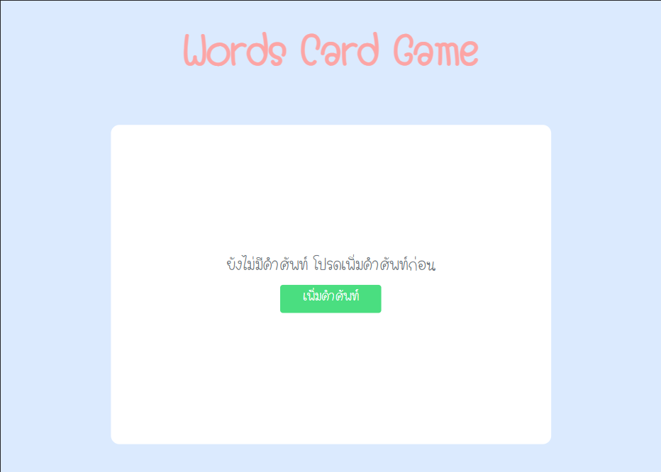

# Words Card Game

เป็นเว็บ Application ที่จะให้ผู้ใช้งานเพิ่มคำศัพท์ภาษาอังกฤษและภาษาไทย เพื่อบันทึกคำศัพท์และยังสามารถนำคำศัพท์มาเล่นเป็นเกมได้
โดยจะสุ่มคำศัพท์ที่ผู้ใช้งานได้บันทึกไว้มาทายโดยจะสามารถเลือกได้ว่าจะทายเป็นภาษาไทยหรืออังกฤษ

### ตัวอย่าง

